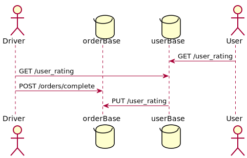

## HW1
### Содержание

- [Описание](#Описание)
- [MVP](#MVP)
- [Архитектура](#Архитектура)
- [API](#API)
- [Тесты](#Тесты)
- [Эксперимент](#Эксперимент)

### Описание

**Идея:** Добавить водителям возможность выставлять оценки по завершении поездки.

Зачем нужна эта фича? (гипотеза)
* Данная фича может увеличить вовлеченность водителей в процесс работы.
* Если сделать этот рейтинг публичным(его могут видеть пассажиры), то это может повлиять на поведение посажиров: вероятно, они будут вести себя корректнее, будут задумываться о своем поведении во время поездки.
* Лояльность водителей к компании может увеличиться, так как они будут видеть, что их мнение учитывается и важно для компании. 
* Данная фича позволит собирать больше полезной информации, благодаря которой можно будет проводить дальнейшее улучшение сервиса. 

Что может пойти не так?
* Из-за рейтинга водители могут начать отказываться от пассажиров -> мы теряем деньги и лояльность клиентов (хотя, если у них плохой рейтинг, то нужны ли такие клиенты? имидж компании?)
* Водители могут выставлять необъективные оценки? У них плохое настроение?
* Водителям может быть лень выставлять какие-то там оценки.

Логично было бы считать рейтинг от последних N оценок, причем последним оценкам давать больший вес, например, чтобы пасажиры могли побыстрее исправить свой плохой рейтинг. 

### MVP
Для начала было бы не плохо узнать, не будет ли лень водителям выставлять оценки. Для этого нужно реализовать функционал только на стороне водителей: возможность выставлять оценки в конце поездки - 1-5 звезд + описание того, что нужно сделать: "дайте оценку пасажиру" или что-то подобное. 

В полноценной версии уже надо будет порабоать над деталями:
* пользователь не должен видеть процесс оценивания, потому что это может повлиять на объективность оценивания водителем: присутствие пассажира при выставлении оценки будет оказывать моральное давление на водителя -> оценка будет не объективной, то есть нужно реализовать функционал так, чтобы окно оценки пассажира всплывало через некоторое время после завершения поездки. 
* Добавить в клиентское приложение возможность просматривать свой рейтинг.
* Добавить в водительское приложение возмжность просматривать все проставленные им ранее оценки. 
* Помимо звездочек добавить возможность оценить какие-либо качества пассажира(имею ввиду, как сейчас пассажиры могут оценить был ли водитель в маске и т.д.)

## Архитектура

Все можно реализовать через уже существующие ручки:
* В ручку завершения заказа добавить поле оценки, и доп. параметров (те самые доп. качества пассажиров)
* В таблицу пользователя также добавить эти поля - его рейтинг, доп данные (храниться они могут в значениях от 0 до 1 - процент поездок, где они были хорошими =) или как-то ещё, зависит от того, что мы собираемся с этими данными потом делать). 
* Актуальный рейтинг можно подтягивать через отдельный микросервис пользователей `GET /users_rating`. При вызове которой микросервис будет просчитывать актуальный рейтинг пользователя, обновлять ее в таблице и возвращать (user_id передается в теле запроса).

[Вверх](#Содержание)

### API

Описание приведено для новой ручки `GET /user_rating` и новое поле для ручки `POST /order/complete` в микросервисе orders ([Файл с описанием API](api.yaml)).

[Вверх](#Содержание)

### Тесты

Юнит тестами покроем:
* В существующих тестах микросервисов users и orders добавим проверку новых полей
* Повторный запрос на проставление оценки для поездки, где она уже стоит не должен изменить существующую оценку/добавить новую, а должен просто венуть 200 
* `GET /user_rating` - случай, когда N < минимального количества оценок для подсчета рейтинга
* `GET /user_rating` - случай, когда N > минимального количества оценок для подсчета рейтинга

Нагрузочное тестирование:
* Установить влияние на производительность новой ручки и полей

[Вверх](#Содержание)

### Эксперимент

Раскатывать будем на часть водителей (самую активную, может территориально их всех в одном городе выбрать), постепенно увеличивая процент юзеров. 

Оценить гипотезы достаточно трудно, но вовлеченность можно оценить по таймауту между заказами, т.е. будет видно, насколько водителю не в падлу работать)) + можем следить за кол-вом отмененных заказов со стороны водителей. Далее можем проследить за тем, как будет меняться средняя оценка всех пользователей: если она возрасла через какой-то срок, то это будет означать, что пассажиры начали следить за собой во время поездки. Так же можно будет отследить среднюю продолжительность работы водителя в компании (будем отслеживать лояльность водителей): но такое, наверное включать не стоит?(
Нас будут интересовать метрики:
* Процент водителей, дающих оценки
* Процент отмененных заказов среди тех водителей, которые дают оценки пассажирам
* Средняя продолжительность работы в компании - под вопросом
* Средняя оценка пассажирам
*cpu/memory quota usage

[Вверх](#Содержание)