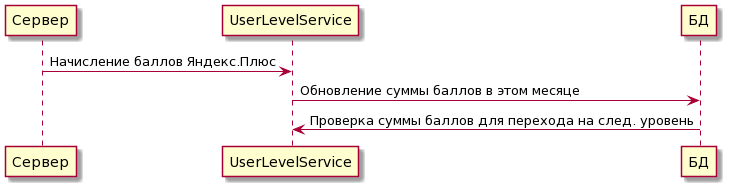
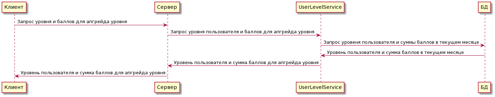

# Фича

**Система уровней лояльности пользователей Yandex Go**

## Описание
#### Гипотеза
Данная фича стимулирует потребительский спрос на пользование сервисами, представленными в Yandex Go. 

#### Алгоритм работы уровей

Пользователи повышают свой уровень лояльности путем использования сервисов. Оценить уровень пользователя можно, посчитав сумму денежных средств, которые он использовал на сервисы Яндекса, представленные в Go. Однако, создание прямой зависимости между деньгами и уровнем может создать негативное впечатление от использования фичи, так как пользователь обращает внимание на сумму потраченных денежных средств.

Вместо этого в качестве метрики предлагается использовать количество заработанных от использования сервисов Yandex Go баллов Яндекс.Плюс. 

Каждый месяц пользователь набирает баллы. Уровень пользователя сохраняется на 2 месяца (на месяц, в котором он был заработан и на следующий). Таким образом, в случае, если пользователь перестал пользоваться сервисами Yandex Go, то он лишается привилегий.

#### Уровни пользователей
Уровни пользователей являются регулируемым параметром и могут изменяться. Предлагается использовать 5 уровней пользователя.
На каждом уровне пользователю становятся доступны определенные привелегии при использовании сервисов: повышенный кэшбек с покупок, кэшбек на определенные товары (например, в Лавке), скидки на Такси по одному конкретному маршруту (из дома на работу, к примеру).

## MVP
Для реализации MVP можно запустить сервис с ограниченным количеством уровней и, соответственно, с уменьшенным количеством привелегий для пользователей для снижения рисков и издержек (в том числе финансовых).

## Микросервис
Предполагаю, что учет баллов Яндекс.Плюс уже производится, а также что каждое изменение баланса баллов Яндекс.Плюс у пользователя привязано к конкретному заказу, так что историю начисления баллов хранить в новом микросервисе нет необходимости.

Создается единственный микросервис, занимающийся учетом начисления баллов пользователю в конкретных месяцах и фиксацией текущего уровня пользователя.

Общение с основным сервером при работе с ручкой по обновлению баллов:

Отображение пользователю текущего уровня и суммы баллов для перехода на следующий уровень:

## API
API описано в файле userlevelservice.yaml

## Тестирование
Юнит тесты:
* Приход новых баллов, сохранение баллов в БД
* Пересчет суммы баллов Яндекс.Плюс и проверка на переход на следующий уровень
* Соответствие привилегий уровню пользователя
* Сброс уровня пользователя при недостаточном количестве баллов

Нагрузочное тестирование:
* При большом количестве обновлений баллов и, соответственно, большом количестве переходов пользователей между уровнями

## Эксперимент
* Постепенное подключение пользователей к фиче, начиная с команды Яндекса, а затем с наиболее "старых" пользователей (так как они более лояльны к сервисам)
* Проведение запуска фичи в небольших городах (для сокращения финансовых издержек)
* Постоянный мониторинг динамики заказов в Yandex Go (есть ли положительные тенденции)
* Привлечение внимания СМИ к фиче после успешного эксперимента в небольших городах
