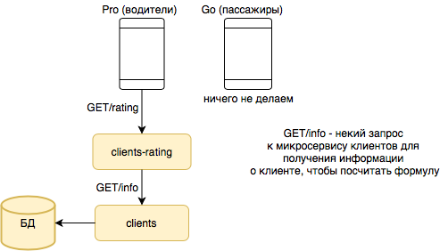
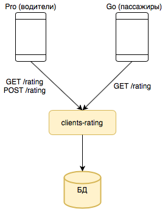

# Рейтинг пассажира.

## 1) Постановка задачи. Гипотеза.

### Постановка задачи: 
Нужно продумать логику выставления оценки водителем после завершения поездки, описать, где и в каком формате должен хранится рейтинг. Подумать над честной формулой вычисления общей оценки. Понять, какие нужны эндпоинты (ручки) для клиентского приложения и водительского. И другие особенности, все, что посчитаете важным.

### Гипотеза:
После реализации фичи повысится безопасность водителя, его автомобиля, и поездки в целом. Возможно данная фича повлияет и на сознательность самих пассажиров (будут реже опаздывать к такси, реже хамить водителю и т.п., так как пассажир рискует рейтингом).

## 2) MVP и полноценный вариант + архитектура.

### MVP: 
Давайте, чтобы сильно не дорабатывать приложение для водителей и для пассажиров, просто создадим микросервис clients-rating, в котором будет один эндпоинт - GET запрос, и при запросе рейтинга пассажира будем просчитывать по формуле рейтинг для конкретного пассажира и выдавать его водителю.  
(Возможный пример формулы, которая бы выдавала примерный рейтинг клиента, основываясь на времени ожидания водителя, а также на числе отмененных заказов: 5 - 4 * min(average-driver-waiting-time / average-time + canceled-orders / count-of-orders, 1), где average-driver-waiting-time - сколько времени в среднем водитель ждет пассажира на месте, average-time - среднее время поездки, canceled-orders - число отменных заказов пассажира, count-of-orders - число заказов пассажира. Возможно, формула не совсем честная и объективная, но она всяко лучше рандомных значений.)



### Полноценный вариант: 
Создадим микросервис clients-rating со своей БД.  
У сервиса будет два эндпоинта:  POST запрос для выставления оценки пассажиру, GET запрос для просмотра рейтинга пассажира.  
В качестве формулы можно взять простое средее арифметическое или же, как предлагают в https://taxi.yandex.ru/action/rating_ru, средневзвешенное из последних N оценок, где недавние оценки имеют больше веса, чем старые.  
В БД можно хранить либо client-id (ключ) + средний рейтинг + последние N оценок, либо можно хранить client-id (ключ) + средний рейтинг + число оценок. Первый вариант позволит нам более гибко настраивать формулу среднего рейтинга, так как у нас больше данных о прошлых оценках, но затраты по памяти у первого много больше, чем у второго варианта, так как во втором варианте нужно просто пересчитать формулу для новой поступившей оценки. 



## 3) API взаимосвязей между компонентами.

```yaml
openapi: 3.0.0
info:
  description: Рейтинг пассажира.
  version: "1.0.0"
  title: clients-rating

paths:
  /rating/clients:
    get:
      operationId: getClientRating
      description: Получить рейтинг пассажира.
      parameters:
        - in: query
          name: client_id
          description: Идентификатор пассажира.
          required: true
          schema:
            type: integer
            format: int64
            minimum: 1
      responses:
        '200':
          $ref: '#/components/responses/ClientRatingResponse'
        '400':
          $ref: '#/components/responses/BadRequestResponse'

    post:
      operationId: postClientRating
      description: Поставить оценку пассажиру.
      requestBody:
        required: true
        content:
          application/json:
            schema: 
              type: object
              required:
                - client_id
                - rating
              properties:
                client_id:
                  type: integer
                  format: int64
                  minimum: 1    
                rating:
                  type: integer
                  format: int32
                  minimum: 1
                  maximum: 5
      responses:
        '200':
          description: Оценка поставлена.
        '400':
          $ref: '#/components/responses/BadRequestResponse'

components:
  responses:
    ClientRatingResponse:
      description: OK
      content:
        application/json:
          schema: 
            type: object
            required:
              - average_rating
            properties:
              average_rating:
                type: number
                format: double
                minimum: 1.0
                maximum: 5.0
    BadRequestResponse:
      description: Bad Request
      content:
        application/json:
          schema: 
            type: object
            properties:
              message:
                type: string      
```

## 4) Тесты.

Юнит тесты для каждой ручки.  
Интеграционные тесты для проверки взаимодействия запросов друг с другом в пределах данного микросервиса.  
Нагрузочные тесты писать я пока не вижу смысла, ибо функционал не является критичным или очень важным.

## 5) Эксперимент. Метрики.

Для эксперимента, который бы проверял наши гипотезы, выберем две контрольные группы: людей, у которых низкий рейтинг и людей, у которых высокий рейтинг. Для первой группы ожидается повышение числа отказов со стороны водителей, а для второй группы ожидается понижение отказов со стороны водителей. То есть основной метрикой будет число отказов со стороны водителей. Если наши ожидания оправдались, то гипотезы верны.

