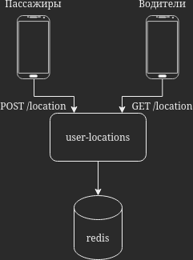
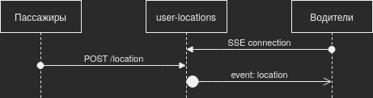
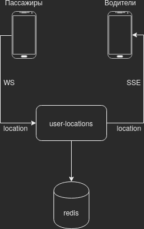
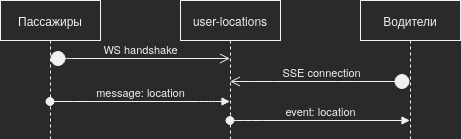

# [Live location](https://taxi.yandex.ru/blog/live-location/)

## Идея фичи
Возможность передавать водителю местоположение пассажира в реальном времени.
Это позволит водителю и пассажиру быстро находить друг друга без необходимости дополнительного контакта.

## План
Клиент пассажира при включении фичи должен отправлять своё актуальное местоположение
и останавливаться при её отключении.
Клиент водителя должен проверять передачу местоположения пассажиром
и в случае передачи отображать на карте местоположение пассажира в реальном времени.

## Архитектура
Достаточная структура данных в базе данных - пара ключа с ID пользователя и значение с геопространственными координатами пользователя.
СУБД redis позволит достичь наибольшей производительности с учётом описанной структуры данных.
Фича не требует взаимодействия с существующей инфраструктурой, поэтому разработка в монолите не целесообразна.
Эффективным архитектурным решением представляется разработка отдельного микросервиса для хранения и выдачи координат пользователей с внутренней базой данных, управляемых redis.

Таким образом, базовую архитектуру фичи можно представить так:


Однако, стоит учесть, что водителю получать от сервера актуальное местоположение пассажира необходимо постоянно.
Клиент водителя может отправлять GET-запросы на получение местоположения регулярно при помощи поллинга,
но это создаёт задержку между пассажиром и водителем и лишнюю нагрузку на сервер.
Вместо этого для получения клиентом автоматических обновлений от сервера можно использовать технологию SSE (Server-Sent Events).


Пассажир при этом отправляет регулярные однотипные HTTP-запросы при каждом изменении местоположения для дальнейшей передачи их содержания водителю через SSE.
Закономерным решением будет заменить протокол и этого соединения для эффективного отправления местоположения в реальном времени,
но SSE создаёт односторонее соединение и не поддерживает передачу данных от клиента серверу.
Для решения этой задачи можно использовать двухсторонний протокол WebSocket.
Итоговую архитектуру можно представить так:



Подключения к микросервису автоматически закрываются после начала поездки,
подключение пассажира к микросервису закрывается при отключении им фичи в клиенте.

На этом этапе можно вспомнить, что водитель тоже передаёт своё местоположение пассажиру.
Если предположить, что архитектура микросервиса для хранения и передачи местоположения водителей схожая,
микросервис для местоположения пассажира целесообразно с ним объединить и передавать оба типа местоположения через одно WebSocket-подключение.

## MVP
Для тестирования гипотезы можно пренебречь архитектурной и функциональной эффективностью
и остановить реализацию на базовой архитектуре с HTTP-запросами.
Потенциально для реализации с минимальными усилиями можно срезать обновление местоположения на клиенте водителя в реальном времени
и обновлять его только при ручном запросе водителя,
так как местоположение пассажира актуально в основном уже при приближении водителя к точке назначения.

## API
Так как архитектура фичи вышла за рамки RESTful API, мы не можем использовать спецификацию OpenAPI для полного описания API.
API, основанные на сообщениях, в частности с использованием WebSocket, обычно определяются спецификацией AsyncAPI.

Соответственное описание API:
```yaml
asyncapi: 2.0.0

info:
  title: Yandex Go live location API
  version: '1.0.0'

channels:
  /location/{user_id}:
    parameters:
      user_id:
        schema:
          type: string
    subscribe:
      message:
        oneOf:
          - $ref: '#/components/messages/location'
          - $ref: '#/components/messages/disable'
          - $ref: '#/components/messages/error'
    publish:
      message:
        oneOf:
          - $ref: '#/components/messages/location'
          - $ref: '#/components/messages/disable'

components:
  messages:
    location:
      payload:
        type: string
        description: Latitude and longitude separated by space
        examples:
          - 55.752023 37.617499
    disable:
      payload:
        type: string
        const: disable
        description: Live location is disabled by the user
    error:
      payload:
        type: string
        description: Connection error description from the user
```

## Тестирование
### Юнит-тестирование
* Успешная обработка задокументированных данных
* Успешное возобновление передачи местоположения после отключения
* Ошибка при вводе неизвестного сообщения
* Ошибка при вводе чисел, не являющихся валидной точкой на карте

### Интеграционное тестирование
* Корректная передача водителю сообщений от пассажира
* Сохранение актуального местоположения в базе данных

### Нагрузочное тестирование
* Корректная работа при максимально частом обновлении местоположения

## Проблемы
В случае потери соединения пассажира с сервером водитель теряет возможность видеть его актуальное местоположение на карте.

В качестве решения сохранённые местоположения в базе данных redis можно использовать как кэш на случай потери соединения и отправлять последнее сохранённое местоположение после установления соединения,
а также визуально оповещать водителя в клиенте о возможной неактуальности местоположения пассажира.

## Эксперимент
Определим пассажиров, которых чаще ищут водители, по звонкам водителя пассажиру и времени ожидания выше среднего,
эти же значения будут используемыми в эксперименте кваргами.
Включаем фичу на них и следим, сократилось ли количество звонков и время ожидания.
Так же можно проследить за изменениями рейтинга пассажиров, чтобы проверить, улучшается ли отношение водителей к пассажирам, если их не нужно искать.
