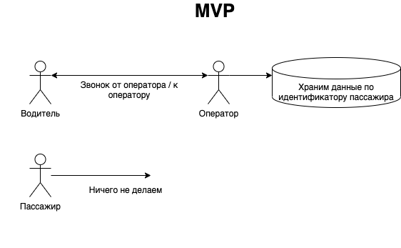
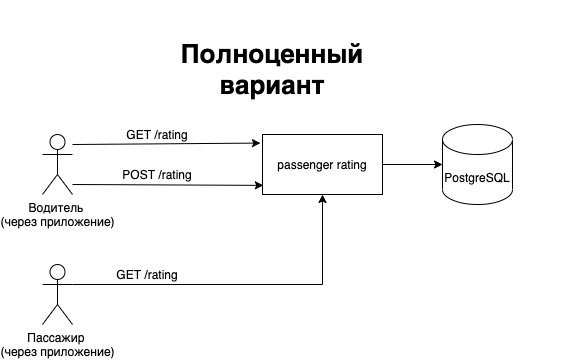

## Описание задачи
Сделать так, чтобы водители такси могли проставлять оценки пассажирам. На основе оценок формируется рейтинг пассажира.
Благодаря чему сервис становится удобней и прозрачней для водителей, что привелекает больше водителей к сервису.

**Глобальная цель** - улучшение сервиса такси


### Гипотезы (что может улучшиться):
* прозрачность (водитель заранее представляет что можно ожидать от клиента, благодаря чему поездка для него становится наиболее предсказуемой и как следствие комфортной);
* благодаря отзывам можно "подcтроиться" под клиента, благодаря чему получить доп. чаевые после поездки;
* клиенты могут стать более приветливыми (в случае если мы откроем для них их рейтинг);
* увеличится количество водителей такси, так как с приятным клиентами (и дающими больше чаевых) работать приятней;


### MVP:
Срезаем углы:
* водители оставляют оценки/отзывы в звонке с оператором;
(в полноценном варианте встраиваем систему оценок в водительское приложение)

Кладем данные в хранилище по идентификатору пассажиров, из которого в последствии достаем оценки и показываем их на экранах водитилей/пассажиров;


### Как работает MVP
* Для части пользователей (пассажиров) (наиболее активных?) вводим систему оценок;
* После поездок таких пассажиров оператор связвается с водителем чтобы получить отзыв о пассажире;
* Оператор записывает в хранилище оценку и отзыв;
* Для таких пассажиров когда водитель нашел заказ связывается оператор и сообщает рейтинг и отзывы.



### Как работает полноценный вариант
* Встраиваем систему оценок в водительское приложение такси;
* Водитель оценивает пассажира после поездки;
* Складываем оценки в базу;
* Достаем оценки в водительском приложении и показываем ему их;
* Так же показываем рейтинг пассажира и в пассажирском приложении.



##### Хранение и вычисление суммарной оценки
В БД хранится вся история оценок по пассажирам. 
Суммарную оценку предлагается рассчитывать как среднее значение за последние 20 (например) поездок.

Вес крайних поездок должен быть больше чем более ранних. 
Так "плохой" пассажир увидев что у него упал рейтинг и взявшись за голову сможет проще исправить оценку и тем самым это подстегнет его улучшить свое отношение.


#### API
_API описано в **openapi.yaml**_


#### Включение фичи
Фичу будем включать плавной расскаткой. 

На этапе MVP включить фичу можно на наиболее активных пользователей, для ускорения сбора данных.

Как вариант - протестировать фичу в отдельном регионе. 

Эксперимент для фичи достаточно сделать рубильником.

"Кварги" для эксперимента - ```exp_kwargs = {'passenger_id': 777, 'city': “Kazan”}```

