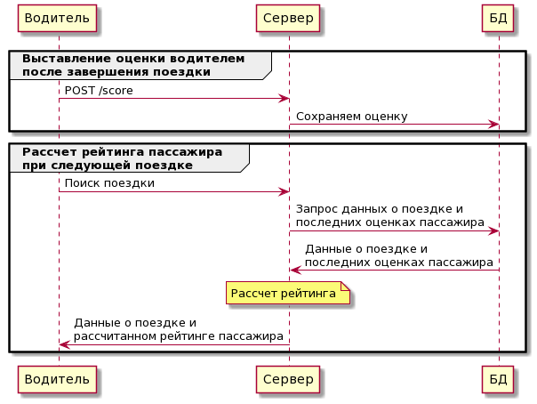

## Идея фичи

У водителей появится возможность оценивать пассажиров после завершения поездки. Из нескольких последних оценок от одного до пяти будет рассчитываться текущий рейтинг пассажира.

Низкий рейтинг пассажира позволит водителям заранее готовиться к конфликтным ситуациям или вовсе отказаться от поездки.

## MVP

В MVP-варианте нужно добавить ендпоинт для выставления оценок водителями, хранение этих оценок в базе данных и отображение рассчитанного рейтинга пассажира для водителей.

В полноценном варианте также будет отображение рейтинга для самих пассажиров.

Таблица оценок в бд будет содержать: id аккаунта пассажира, число от 1 до 5, дату и время поездки

API эндпоинт для внесения оценки описан в [openapi.yaml](openapi.yaml)

## Тесты

Юнит-тесты нового эндпоинта: 
* Успешное сохранение оценки в бд
* Внесение оценки для пассажира, отсутствующего в бд
* Передача невалидных значений

Интеграционные тесты:
* Внесение оценки водителем
* Отображения рейтинга пассажира у водителей и у пассажиров

В первую очередь стоит включить фичу для водителей с наибольшей активностью и хорошим рейтингом. Проследить за количеством отказов от поездки среди водителей с включенной фичей и без нее. 
