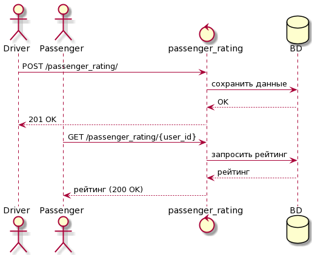

# Разработка фичи "Рейтинг пассажира"

### Описание фичи
Рейтинг пассажира необходим для лучшего взаимодействия пассажира и водителя. Водитель сможет ставить
оценку от 1 до 5 в разных критериях, например вежливость, аккуратность и т.д. Для вычисления оценки от водителя
считается среднее арифметическое по всем критериям, далее вычисленное значение сохраняется в бд.
А общий рейтинг считается как среднее арифметическое 20 последних оценок.
### MVP
В MVP варинте сделать возможность выставления оценки только по общему критерию, т.е без разделения на подкритерии.
Рейтинг считать как среднее арифметическое последних 20 оценок. Фичу реализовать на web-сайте.

### Полный вариант
В полноценном варианте водитель сможет ставить оценку по разным критериям. Сервис реализуется микросервисом passenger-rating. Предусмотрены две ручки - POST на добавление оценки и GET на её получение.
БД имеет следующию структуру:

#### Sequence Diagram

API смотреть в [passenger_rating.yml](passenger_rating.yml)

### Тестирование
На этапе разработки код покрывается юнит-тестами:
* Проверить расчёт общего рейтинга пассажира при отсутствии поездок 
* Передача невалидных значений

Интеграционные тесты:
* Проверка отображения рейтинга пассажира у водителей и у пассажиров
