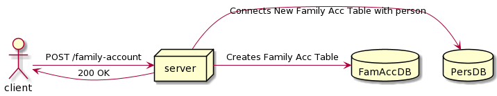
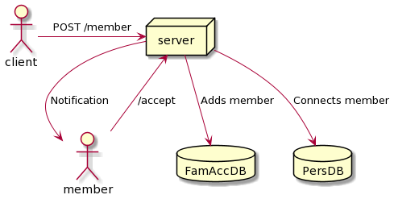

# Семейный аккаунт
## Описание задачи
Добавление семейного аккаунта, т.е. аккаунта с одним способом оплаты для нескольких пользователей.
### Гипотеза
Подобная фича способна привлечь дополнительных пользователей, в частности таких пользователей, которые по какой-то причине еще не имеют банковской карты(например дети) или пользователей, которые не до конца доверяют современным технологияв в плане безопасности платежных данных или для которых процесс привязывания карты слишком сложен(старшее поколение)

## MVP
Самый быстрый вариант проверить минимальную работоспособность:
### Добавление
1. Пользоваетель (1) вводит адрес аккунта того человека (2), которого хочет привязать к MVP семейного аккаунта.
2. Дефолтный вариант оплаты пользователя 2 меняется на дефолтный вариант пользователя 1.
### Удаление
1. Пользоваетель (1) вводит адрес аккунта того человека (2), которого хочет удалить из MVP семейного аккаунта.
2. Дефолтный вариант оплаты пользователя 2 меняется на любой из доступных до привязки к семейному аккаунту или становится пустым.

Следует отметить, что это не более чем MVP, влекущее за собой некоторые риски безопасности. В частности:
1. Пользователь 2 не получает уведомлений о смене средства оплаты, равно как и о его удалении
2. Есть вероятность забыть удалить добавленное другому пользователю средство оплаты

К преимуществам MVP можно отнести:
1. Быструю скорость клиентской разработки. Необходимо добавить 2 кнопки: "добавить" и "удалить" и одну форму для ввода аккаунта.
2. Скорость разработки серверной части. Не требуется создание новых таблиц, все операции возможно проводить с существующей моделью данных.

## Архитектура
Необходимо создать новую сущность "Семейный аккаунт" в которой будут поля:
1. Владелец аккаунта
2. Способ оплаты
3. Приглашенные пользователи

Также у каждого приглашенного пользователя необходимо добавить столбец с ссылкой на привязанный семейный аккаунт.

## Тесты
1. Добавление самого себя в семейный аккаунт
2. Добавление более 3х пользователей в семейный аккаунт
3. Добавить одного пользователя 2 и более раз
4. Проверить невозможность удалить владельца семейного аккаунта
5. Проверить невозможность добавления пользователей не владельцем аккаунта
6. Невозможность добавть пользователя в 2 семейных аккаунта
7. Проверить что способ оплаты удален у всех пользователей при удалении семейного аккаунта

## Включение фичи
Включение фичи постепенное, сначала у определенной группы пользователей. В эту группу можно отнести:
1. Людей, которые часто заказывают такси не для себя
2. Людей в возрастной категории 30-40 лет. Скорее всего у них есть дети, которые уже достаточно взрослые чтобы пользоваться смартфонами и самим перемещаться по городу, но недостаточно взрослые, чтобы иметь собственную карту. Так же, скорее всего, родители у данной возрастной группы находятся в группе 60-70 лет. Возможно, люди подобного возраста не до конца освоились с современными технологиями и семейный аккаунт поможет им проще пользоваться такси.

## Метрики
1. Количество созданных семейных аккаунтов
2. Количество непустых (не только владелец) семейных аккаунтов
3. Количество поездок, совершенных приглашенными членами семейного аккаунта. Количество поездок владельца аккаунта, наверное, можно не считать, т.к. по-моему владелец не является целевой аудиторией семейного аккаунта.