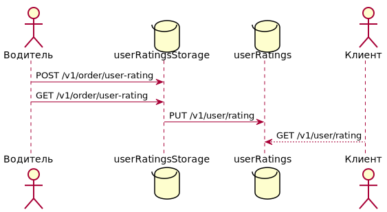

# Рейтинг пассажира
## Описание задачи
Сделать возможным для водителей выставлять рейтинг пассажирам после поездки.

Зачем нужна эта фича:
* Оценка зависит напрямую от поведения пассажира во время поездки. Пассажир, зная, что после поездки его будут оценивать, будет стараться вести себя корректнее.
* Повысить доверие к компании со стороны водителей, дать им понять, что их мнение учитывается и является важным.
* При обращение водителя/пассажира в службу поддержки у сотрудников компании появится дополнительный фактор для принятия правильного решения.

Возможные проблемы:
* Водители могут оценивать не пассажира, а свое настроение, необходимо учесть это в формуле подсчёта рейтинга.
* Водители не будут выставлять оценки.

Рейтинг будет вычислять как средневзвешенное из N последних оценок, где самые свежие оценки имеют наибольший вес.

## MVP
В первую очередь нам необходимо убедиться в том, что водители будут ставить оценки пассажирам. Для проверки этой гипотезы необходимо реализовать фичу только на стороне приложения для водителей.

Методы API которые нужны для MVP:
* Выставление оценки после заказа.
* Просмотр выставленных оценок в списке поездок.

## Архитектура
Для водителей и пользователей данная фича несет различный функционал:
* Водители оценивают пассажиров после завершения заказов и могут посмотреть ранее выставленные оценки в списке заказов.
* Пользователь видит свой рейтинг в виде числа от 1 до 5 без детализации по поездкам.

Поэтому стоит разбить функционал фичи на два микросервиса:
* **user-ratings-storage** - микросервис для сохранения, выдачи и подсчёта рейтинга пользователя на основе всех полученных оценок за поездки. Задача по подсчёту рейтинга ставится в очередь, так как не требует моментального решения.
* **user-ratings** - микросервис занимается хранением и отдачей рейтинга в клиентское приложение.

### Выбор и структура БД для *user-ratings-storage*
Для хранения информации об оценках я выбрал реляционную базу данных PostgreSQL. Структура таблицы с оценками:
* id
* order_id
* user_id
* score
* created_on

### Выбор и структура БД для *user-ratings*
Информацию о рейтинге пассажира можно представить в виде пары key-value, где ключом является id пользователя, а значением - вычисленный рейтинг. В качестве используемой база данных я выберу Redis.

## API

[Ссылка](./api.yaml "Описание API") на описание API

## Тестирование
* Unit тесты
    * user-ratings-storage
        * Сохранение оценки
            * Если у поездки уже стоит оценка запрос должен вернуть её, а не добавлять еще одну или изменять существующую
            * Если оценка за поездку еще не проставлена
        * Получение оценки
            * Если у поездки еще нет оценки
            * Если у поездки уже есть оценка
    * user-ratings
        * Обновление рейтинга
            * Если у пользователя еще нет рейтинга
            * Если у пользователя уже есть рейтинг
        * Выдача рейтинга
            * Если у пользователя еще нет рейтинга
            * Если у пользователя уже есть рейтинг
* Нагрузочное тестирование
    * Проверить сколько оперативной памяти потребляет Redis при наличии оценок у большей части аудитории сервиса.
    * Узнать сколько запросов в секунду сервисы способны отрабатывать

## Выкатка
В первую очередь доступ к сервису стоит дать водителям с большим количеством поездок и хорошим рейтингом. Фичу можно начать выкатывать в нескольких больших городах, где количество совершаемых поездок достаточно для последующей аналитики. 

Бизнес должен анализировать процент выставленных оценок от числа завершенных заказов, на сколько сильно отличаются отзывы пассажира и водителя за поездку. Стоит проверить поведение пользователя после ухудшения рейтинга, продолжит ли он пользоваться сервисом.

Технические специалисты должны проверять увеличение нагрузки на RAM, влияние на скорость загрузки страницы истории поездок.

В случае успешных результатов аналитики можно продолжать выкатку на всех пользователей.
