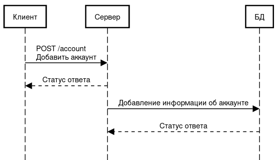
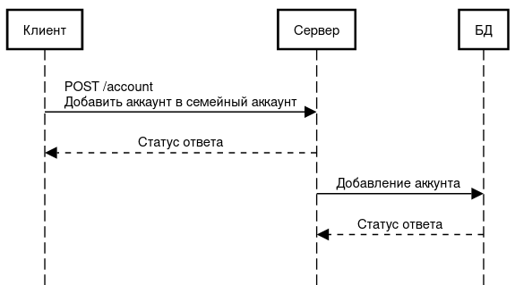
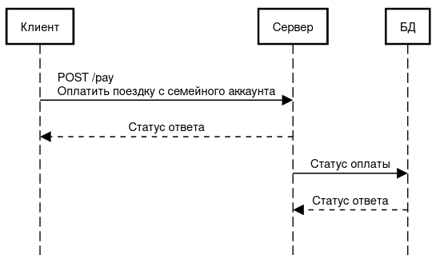

# Фича: семейный аккаунт в yandex-taxi

У людей появиться возможность создавать семейные аккаунты для поездок в такси. Это позволит членам семьи в случае чего оплачивать поездки друг другу. Например, родителям поездки детей.

Если добавить эту фичу в приложение, то увеличиться кол-во поездок людей на такси. 

# MVP

Надо добавить в дазу данных аккаунтов поле ___family_account_id___, в нем будет храниться ссылка на новую таблицу, например, ___family_accounts___, где уже будет храниться вся информация об семейном аккаунте, а именно привязанную к нему карту, участники, создатель семейного аккаунта и т.д.

Обработку добавления аккаунта и добавление людей в аккаунт можно добавить в существующий эндпоинт обработку аккаунтов.

Обработку же оплаты с семейного аккаунт добавить уже в существующий эндпоинт оплаты поездки.

# Архитектура

# API

описание api в формате openapi v3 [openapi.yaml](./openapi.yaml)

# Тесты

В новых тестах нет особого смысла, так как используются прошлые эндпоинты, которые по идее уже должны быть протестированы

# Формат эксперимента для включения фичи

У нас нет какой-либо информации об связях аккаунтов, по родственным отношениям, поэтому мы не можем выборочно включить опцию для людей, имеющих семью, значит нам придется выбирать людей рандомно.

Основной мерой успешности фичи и главной гипотезой является увеличение кол-во поездок у людей, соответственно это и будет основной метрикой.