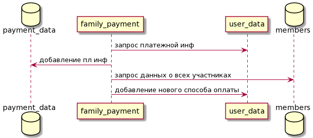

# Один аккаунт для всей семьи

## Задача

Возможность общего способа оплаты для нескольких аккаунтов

## MVP

- Что будет если эту фичу не делать
  - При необходимости оплатить поездку за другого человека, пользователи будут заказывать такси со своего аккаунта. Поэтому, у водителя не будет данных о пассажире
  - Те, у кого нет доступа к платежной информации (например, дети), не смогут самостоятельно заказать такси
- Как можно проверить минимально возможными силами
  - Дать доступ к функции случайно отобранной группе пользователей. Это позволит сильно упростить архитектуру

### Функционал

- Манипуляции с участниками группы
  - добавление
  - изменение данных
  - удаление
- Манипуляции со способами оплаты
  - добавление уже верифицированной карты
  - удаление
  - изменение

В полной версии можно будет добавить возможность добавление нового способа оплаты (в MVP только привязанные карты)

## Архитектура

Для реализации вышеописанного функционала нам потребуется хранить платежные данные и участников группы. Т.к. информация и о тех и о других уже где-то храниться, нам потребуется хранить только ссылки.

### Добавление/удаление пользователя из группы

- Занесение/удаление ссылки на его YID в базе Members
- Добавление/удаление группового способа оплаты

### Изменение платежной информации

- Изменение состояния базы с пл инф
- Запросы на изменение способов оплаты для каждого члена группы

### API

## Тестирование
- UNIT: Проверить crud для участников группы и способов оплаты
- INTEGR: проверить правильность взаимодействия с внешними сервисами
  - добавление/удаление семейного способа оплаты для пользователя
  - правильность привязки пользователя к семейному аккаунту

### Corner cases
Предусмотреть ситуации

- удаление группы
  - группы не существует
  - у участника нет прав для удаления (приглашенный)
- создание группы
  - пользователь уже является участником какой-либо группы
- удаление способа оплаты
  - у участника нет прав на удаление (приглашенный)
  - запрашиваемая карта не привязана к семейному аккаунту

### Включение фичи
Включать фичу будем на ограниченную группу людей. Отбор проводится, опираясь на 

- частоту заказов для другого человека (в такси есть такая опция)
- возраст человека. Посчитать статистику, какие возрастные группы чаще всего заказывают такси кому-то ещё 
