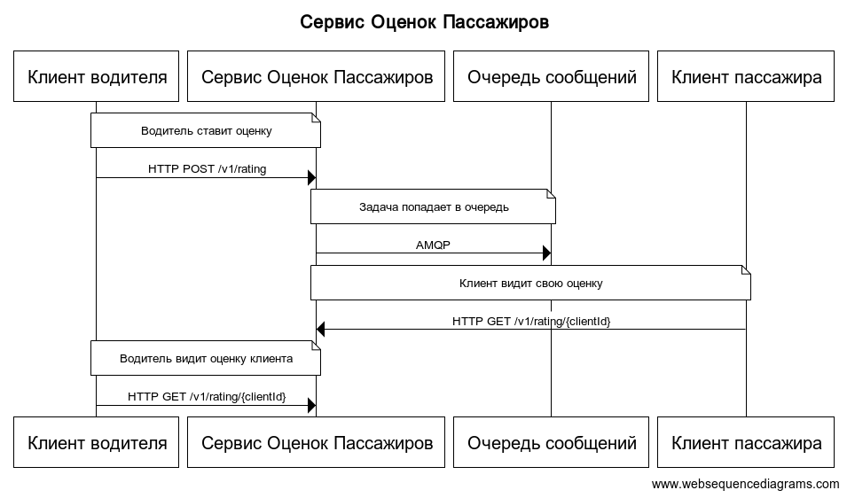
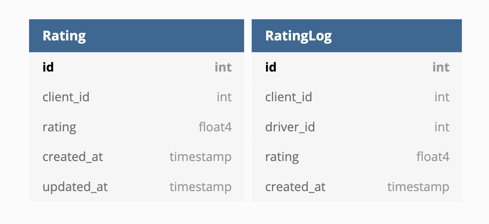

# Документация по разработке программного обеспечения "Рейтинг пассажира"

### Описание задачи
Нужно продумать логику и реализацию выставления оценки пассажирам от водителей после завершения поездки.
Решить какою пользу эта фича может принести приложению, продумать техническую реализацию

### Зачем?
* Улучшить опыт взаимодействия водителей с приложением
* Повысить привлекательность сервиса для водителей
* Ограничение доступа к приложению грубым клиентам
* Поощрение вежливых клиентов

### MVP
* Сразу имеет смысл сделать отдельное web-приложение "Сервис Оценок Пассажиров"
Это будет дешевле, чем попытка внедрить подобную логику в какое-то другое, уже работающее приложение и будет полезно в будущем,
когда популярность фичи возрастет и нам потребуется масштабировать наш сервис.

* Также стоит подумать над тем по каким правилам мы будем выставлять оценку пользователю.
Для начала можно брать просто среднее арифметическое всех оценок, считая что новые оценки
обладают большим весом (пользователь стал вести себя лучше). Получается нужно хранить итоговую оценку пользователя, плюс
все выстеленные ему оценки с датой.

* В перспективе можем подумать над тем, что нужно учитывать другие факторы: например, есть "вредный" водитель,
который специально ставит всем плохие оценки.
Эта логика в последствии может быть реализована с помощью модели машинного обучения.

* Так как задача по подсчету оценки может быть ресурсоемкой (модель машинного обучения)
и нам не требуется мгновенный ответ от сервиса с оценкой пользователя, мы можем использовать очередь сообщений.
Куда поместим задачу по расчету оценки, что будет заделом на будущее и сделает наш сервис устойчивым к нагрузкам.


### Архитектура
В MVP нужно реализовать 2 эндпоинта:
* водитель ставит оценку
* клиентские приложения забирают актуальную оценку

Ниже представленна архитектура нашего вервиса:



### Хранение данных
Создадим 2 таблицы:
* Rating – тут будем хранить рейтинг для каждого клиента, создадим индекс по полю client_id
 для ускорения запроса на чтение
* RatingLog – тут будем хранить все оценки клиента от водителей, плюс время добавления,
 чтобы потом иметь возможность пересчитать рейтинг



Потом можно добавлять в таблицу RatingLog новые колонки: рейтинг водителя, время поездки, цена поездки и т.д.
 Для улучшения алгоритма
 
### Описание API
Доступно в файле ```api.yml```

### Проверка гипотез
В пункте **Зачем?** мы выдвинули предположения того, как фича поможет улучшить сервис,
 чтобы количественно оценить эти гипотезы будем наблюдать за следующими метриками:
 
 * Водители стали меньше уходить из приложения
 * Динамика подключения водителей к сервису увеличилась
 * Водители охотнее берут заказы от пассажиров с высоким рейтингом
 * Пассажиры оставляют больше чаевых
