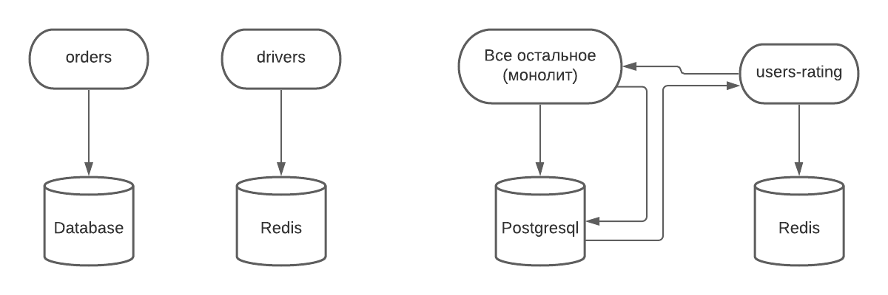
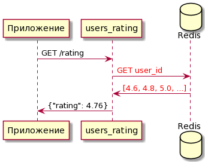
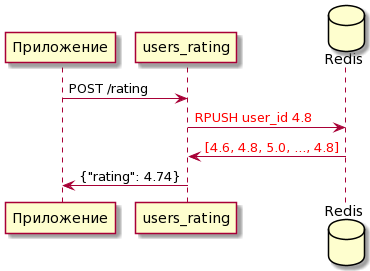

# Рейтинг пассажира


>[Реакция пользователей на появление рейтинга в 2020](https://habr.com/ru/post/490746/)


### Цель

Сама суть фичи состоит в геймификации процесса для обеих сторон (водитель и пассажир).
Наша теоритическая выгода состоит в более человеческих отношения между пользователями и водителями, а 
также может помочь избежать конфликтных ситуаций.

>На самом деле исходя из отзывов данный рейтинг мало что поменял 
> (условно отказаться везти пассажира с рейтингом 2.0 безнаказанно яндекс.про вам не разрешит),
>  но как статистическая фича и описанная выше геймификация выглядит неплохо и как мне кажется
> на поведение пассажиров она все таки повлияла

### mvp

>По информации самого яндекса - рейтинг у пассажира был изначально и год назад
>его просто сделали публичным для пассажиров, но допустим что этого рейтинга вообще нет

1) Что будет если не будем делать?

Ничего плохого, но иначе мы получим классную статистику 
(у водителя будет много [пунктов](https://hsto.org/getpro/habr/post_images/0cc/a0b/466/0cca0b46618a5e1f91a67996c73c58a1.png) для пояснения плохой оценки) и в теории
улучшим качество сервиса для обеих сторон

2) Как можно проверить гипотезу минимально возможными силами?

Делаем оценки пассажиров видимыми только для водителей, ждем пока они
наставят оценок и смотрим увеличилось ли число отказов 
(по сути это наш единственный риск), если все хорошо открываем рейтинг для юзеров
(пусть любуются и если рейтинг плохой - работают над собой)


### Архитектура

Для нашего mvp мы замутим микросервис `users-rating` и после mvp оставим фичу там же 
(монолиты — зло)

Наш микросервис будет использовать Redis (ведь грубо говоря мы имеем структуру типа `{user_id: rating_list`), 
а приложение будет просто в него ходить за рейтингом для отображения или изменения




А запросы будут происходить примерно так



То есть запрошенный рейтинг приложение для своего отображения будет 
получать минуя монолит, что сильно упрощает внедрение фичи

Аналогично все будет и с изменением рейтинга, приложение будет отправлять оценку,
наш микросервис на ее основе меняет рейтинг, сует новые данные в редис и возвращает обратно новый рейтинг.




Примерную схему эндпоинтов в users-rating можно найти в [openapi.yaml](./assets/openapi.yaml)


### Тесты

Тесты самые очевидные: потестили локальное получение изменение рейтинга (юнит), запустили все в тестовой среде и сходили
в сервис из приложения для тех же вещей, нагрузочно можно даже не тестить, вряд ли какой то нереальный дудос оценками может произойти

### Граничные ситуации

Юзеры узнали что их рейтинг не 5.0, хотя считали себя идеальными пассажирами и старались
не обращать внимания на мелкие недочеты водителя, а водители оказывается так не делали. Пассажиры начинают 
придираться, водители мстят, рейтинги у всех падают, количество разборок через поддержку растет, данные получаются нерелевантными.

Да и вообще многие будут против оценки себя за свои же деньги, но суть фичи заключается в человеческом отношении всех ко всем,
так что при внедрении надеемся что такого не произойдет (никто не мешает проверить на мелких группах).


### Формат эксперимента для включения фичи

Обычный эксперимент с кваргами

### На кого стоит включать в первую очередь, какие кварги использовать, за какими бизнесовыми и техническими метриками следить

Во избежание ситуации, описанной выше, соберем АБ группу из людей с рейтингом 5.0 и тех у кого он меньше,
оценим исходящие оценки после лицезрения своего рейтинга и сравним с предыдущими оценками, дальше действуем по ситуации.
Если оказалось что мы живем в повелителе мух — укатываем фичу, иначе же выкатываем на всех.


Пример кваргов данной фичи:

```python3
users_count = await get_all_users_count()
exp_kwargs = {
    "users_ids": get_low_rating_users(max_count=users_count // 100)
    + get_high_rating_users(max_count=users_count // 100),
}
matched_experiments = await experiments3.get_values(exp_kwargs)
if "users_rating_feature" in matched_experiments:
    ...

```


В эксперименте следим за выставлением оценок тестовыми группами ну и за 
изменениями кол-ва заказов естественно, также смотрим не стало ли больше обращений
в поддержку.

Если оценки не сильно поменялись в худшую сторону катим фичу радуемся жизни.

