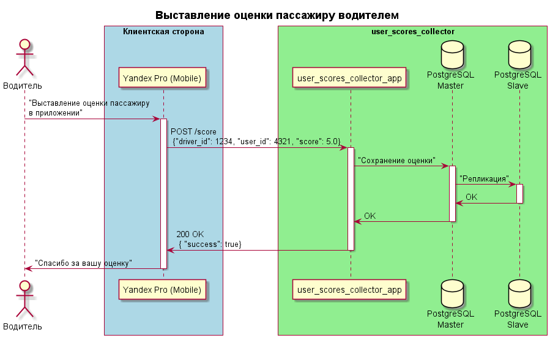
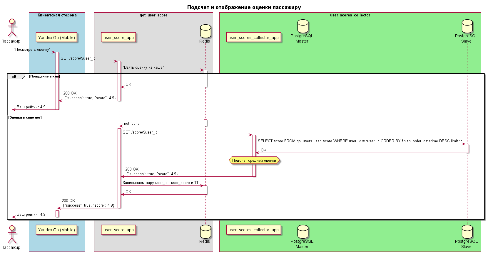

**Рейтинг пассажира**
----

#### Описание
Сделать в приложении Yandex Pro возможность выставления оценки пассажирам после завершения заказа. В приложении Yandex Go должна отображаться средняя оценка за последние N поездок.
#### Гипотезы
- Стимулирование пассажиров быть более вежливыми и аккуратными во время поездки, т. к. оценка пассажира будет видна при приеме заказа у водителя. Пассажирам с низким рейтингом чаще будут отказывать хорошие водители.
- Пассажирам может быть интересно, как их оценивают другие люди и это будет стимулировать их чаще пользоваться услугами Yandex Go. Эдакий тиндер стайл, только без знакомств.

Если коротко, цели могут быть сформулированы так: создание более благоприятной экосистемы для взаимодействия клиент-услуга и увеличение прибыли.

#### MVP
Два микросервиса:
- **user_scores_collector** - для сбора, хранения оценок от водителей, а так же для подсчета средней "оверол" оценки для отображения пассажиру. БД - [postgres](https://www.postgresql.org/) в связке master - slave.
- **user_score_getter** - для получения оценки, ее кэширования и непосредственной отдачи на мобильное приложение. БД - [redis](https://redis.io/) в роли кэша.
MVP - без интеграции с мобильными приложениями. В качестве данных для выставления оценок пролить искуственно сгенерированные данные в postgres: информацию о поездках и оценки.
Схемы взаимодействия:

---

Подробнее про ручки [тут](https://app.swaggerhub.com/apis/NameLeSS-93/user_scores_collector/1.0.0#/)

#### Тестирование

- Во время разработки покрытие функционала юнит тестами. Отдельное внимание уделить обработке случая, когда у пользователя пока нет ни одной оценки.
- После раскатки на тестовые среды функциональное тестирование (ручное/автоматизированное).
- Проведение нагрузочного тестирование на prod-like тестовом контуре. В постгре должны быть налиты адекватные тестовые данные с некоторым запасом, скажем, объем данных в бд должен соответствовать объему данных через год после запуска фичи в прод.
- Совместно с бизнесом и аналитиками собрать профиль НТ по кейсам выставления оценки и запроса оценки, определить критерии успешности прохождения тестирования: утилизация аппаратных ресурсов, время ответа, среднее, перцентиль и др.
Рекомендуемые НТ: 
    - Поиск максимальной производитьельности системы для определения максимального TPS на эндпоинты */score*. Нагрузка подается ступеньками до тех пор пока не будеть нарушен хотя бы один из критериев успешности.
    - Длительный тест при стабильной нагрузки (например 70% от найденного максимума). 24 часа и более.
    - Набор тестов отказоустойчивости: с последовательным отключеним постгреса, редиса, отключением части под приклада.

Помимо стандартных результатов НТ ожидается:
- Определение величины TTL рейтинга в кэше. Прийти к паритету со стороны hit cache ratio (не менее 80%) с требованиям со стороны продакт дизайна, насколько пользователю будет критично увидеть изменение своего рейтинга не сразу после поездки, а скажем только через час или мб больший промежуток времени.
 - Целесообразность применения альтернативного метода реплицирования данных в постгресе.
- Целесообразность применения кластеризации redis.
- Количество ПОД под приклад.

#### Оценка результата
Перед выкаткой на прод обкатать фичу на сотрудниках яндекса, собрать фидбэк. Далее А/Б тестирование. Включение фичи в одном конкретном регионе.
Поднятие мониторинга в проде. Помимо аппаратных метрик: утилизация CPU, память и тд, снимать бизнесовые метрики, как то время ответа сервиса, общее количество оценок (их количество больше или меньше ожидаемого?) количество высоких оценок, количество низких оценок пассажирам. Оценить изменение в количестве заказов (упало/выросло/не изменилось). Оценка гипотезы о частых отказах для пассажиров с низким рейтингом и как этот рейтинг изменяется в дальнейшем (стал ли поссажир более вежлив).Необходимо понимать величину hit cache ratio на редисе, утилизацию памяти. Мониторинг нагрузки на postgres: CPU, память, диски, утилизация коннектов, топ SQL запросов по длительности выполнения.