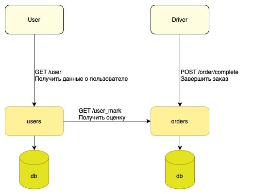

## HW1
### Содержание

- [Описание](#Описание)
- [MVP](#MVP)
- [Архитектура](#Архитектура)
- [API](#API)
- [Тесты](#Тесты)
- [Эксперимент](#Эксперимент)


### Описание

**Идея:** Добавить рейтинг пользователя в приложение Yandex Go. 

Эта фича улучшит опыт работы водителя с приложением, что повысит его удовлетворенность работой.

Расчет рейтинга должен производиться на базе последних N оценках. В рамках MVP будем считать среднее значение по N=10 последних поездкам. Формула расчета:

```
rating = sum(mark_1 + ... + mark_N) / N
```


**Гипотезы:**
- Меньше отмен заказов
- Выше лояльность водителей

[Вверх](#Содержание)


### MVP

В рамках простой реализации можно добавить отдельное окно, выпадающее при завершении заказа водителем. Для простоты реализации оно может содержать только интерфейс оценивания (5 кликабельных звезд) и описание действия ("оцените пассажира").

Для полноценной реализации необходимо переработать интерфейс завершения заказов водителем. Добавить в него интерфейс оценивания. Для полноценной реализации необходимо также предусмотреть следующие особенности:
- Пользователь не должен видеть оценки, поэтому возможна реализация оценивания в отдельном интерфейсе, который будет выводиться на экран через некоторое время после завершения заказа.
- Можно выводить на экран оценивания фотографию пользователя, так водитель будет понимать, кого он оценивает и, возможно, воздержится от оценки, если фото не совпадает с лицом пассажира (если владелец аккаунта вызвал такси другому человеку).
- При оценке ниже максимальной следует уточнить причину (вывести дополнительное меню с вариантами или текстовое поле для полноценного описания).  

Для полноценного решения необходимо привлечь команду дизайнеров, тогда как MVP можно сделать без них (сделать простой интерфейс).

[Вверх](#Содержание)

### Архитектура

В существуюшие ручки завершения заказа водителем и получения информации пользователя о себе можно добавить поле "оценка". 
В таблице полльзователей будет необходимо добавить этот параметр. Такая денормализация позволит снизить нагрузку на получение оценок. 

Актуальную оценку можно считать по крону в микросервисе пользователей. Для этого нужно добавить ручку `GET /user_mark`. При ее вызове микросервис заказов будет считать актуальную оценку по последним N заказам (user id и N можно передавать в теле запроса).
После чего эту оценку можно сохранить в записи пользователя.

Вопрос выбора БД и языка разработки не поднимается, так как мы работаем в рамках существующей инфраструктуры.



[Вверх](#Содержание)

### API

Описание приведено для новой ручки `GET /user_mark` и новое поле для ручки `POST /order/complete` в микросервисе orders ([Файл с описанием API](swagger.yaml).

[Вверх](#Содержание)

### Тесты

Юнит тестами покроем функцию расчета оценки пользователя при граничных ситуациях:
- при недостаточном количестве оценок < N 
- при избыточном количестве оценок > N

Также добавим проверку обработки нового поля в существующие юнит тесты микросервисов orders и users. 

В рамках нагрузочного тестирования проверим насколько новое поле и ручка влияют на производительность системы в целом.

[Вверх](#Содержание)

### Эксперимент

После проверок в рамках команды, будем раскатывать на часть водителей последовательно увеличивая процент охвата.

Исходя из гипотезы, в рамках эксперимента будем наблюдать за количеством отмен заказов водителями после внедрения фичи.
Нас будут интересовать метрики:
- Процент водителей, сделавших оценку
- Количество отмен заказов этой группы водителей до внедрения и после (будем наблюдать за динамикой количества отмен)
- cpu/memory quota usage 

[Вверх](#Содержание)
