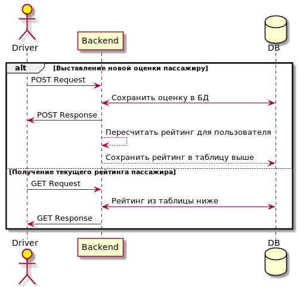

# Домашняя работа 1. Проработка фичи

1. ### Описание и цели задачи

Выставление оценки водителем после завершения поездки.

Фича позволит:

- Выявить нежелательных клиентов для компании
- Создать более благоприятные условия для работы водителей
- Собрать данные для последующего анализа

2. ### MVP

- Используем Python
- Создаем отдельный микросервис со своей базой данных
- Добавляем ручки только для водительского приложения
- Достаточно хранить оценку и идентификатор пассажира
- Взять максимально простую формулу без изменения веса для оценки

3. ### Архитектура

Для формулы расчета оценки будем:

- Отбрасывать экстремальные значения
- Давать больший вес последним оценкам
- Не показывать рейтинг для пассажиров с малым количеством оценок
- Попробуем рассмотреть разные способы оценки и включим это в А/Б эксперимент
- Сам расчет будем добавлять в очередь, чтобы снизить нагрузку

В данном случае данные структурированы, подойдет реляционная БД

| Поле | Описание | Тип данных |
| ---- | -------- | ---------- |
| id | Идентификатор оценки | BigSerial
| score | Оценка | Decimal
| passenger_id | Идентификатор пассажира | FK
| driver_id | Идентификатор водителя | FK
| trip_id | Идентификатор поездки | FK
| created_at | Дата и время выставления оценки | DateTime
| comment | Комментарий водителя | Varchar

*Хранение оценок*

| Поле | Описание | Тип данных |
| ---- | -------- | ---------- |
| passenger_id | Идентификатор пользователя | FK
| rating | Рейтинг пользователя | Decimal
| score_count | Количество оценок от водителей | Integer

*Хранение рейтинга*

4. ### API

[Swagger OpenAPI](openapi.yaml)

5. ### Тесты

Юнит-тестами проверим:

- Стандартные ситуации, сохранение и получение оценки
- Граничные случаи, например для самой первой оценки пассажира
- Будет ли рейтинг действительно скрыт при первых n оценках
- Правильно ли происходит расчет формулы

Проведем нагрузочное тестирование по пиковому количеству заказов, поскольку оценок всегда будет меньше

6. ### Формат эксперимента

- Проведем поэтапное включение фичи
- В первую очередь включим для водителей с недавними жалобами на пассажиров
- Привлечем внимание к фиче уведомлением, чтобы получить больший фидбек
- Проверим частоту выставления оценки, процент от общего числа заказов
- Проследим за метрикой трудоустройства новых водителей, проведем опрос среди нынешних
