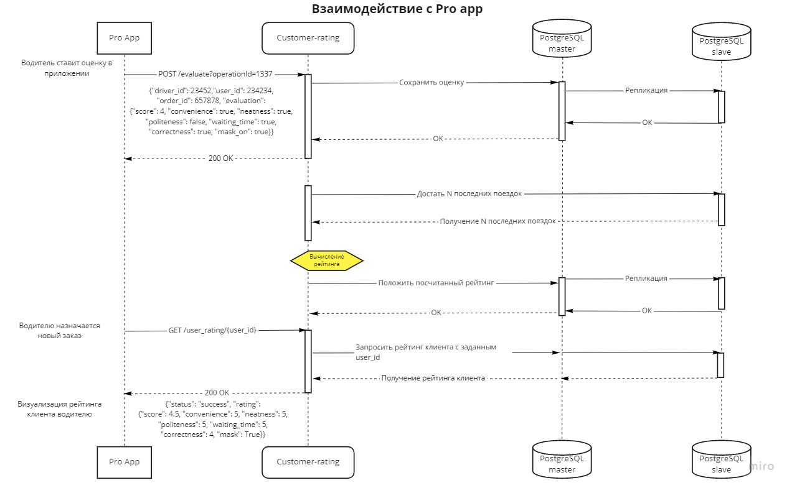
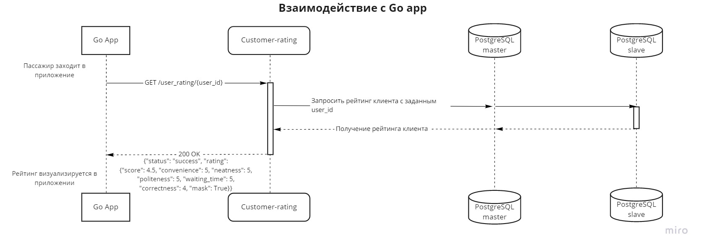

# Задание №1. Архитектура фичи рейтинга пассажиров.
### Описание

Предлагается ввести пользовательский рейтинг для клиентов Яндекс Go такси на основе оценок, выставляемых водителями после
поездки. Цель введения фичи — повлиять на поведение пассажиров и создать более благоприятную атмосферу как для водителей,
так и для пассажиров. Добавление рейтинга пассажира позволит подтолкнуть людей к осознанному отношению к водителям и их 
автомобилям. 

### Гипотезы
1. Поддержание собственного высокого рейтинга будет стимулировать пользователей такси выбирать более удобные точки для 
   подачи автомобиля, сокращать время ожидания для водителя и подробнее указывать детали заказа.
   
2. В период пандемии важно соблюдать ношение средств защиты. Для пассажиров, пренебрегающих этим, существует "наказание"
   в виде снижения рейтинга.
   
3. Возможность быть оцененным заставит пассажира быть вежливее к водителю и бережнее к его авто.

### Этапы реализации
* MVP - добавление оценки пассажира водителем после поездки путем выставления от 1 до 5 звёздочек,
  расчет рейтинга по историческим данным поездок для каждого клиента, вывод общего рейтинга в клиентском приложении в 
  виде средневзвешенной суммы — одного числа.
  
___
* Расширенный вариант — помимо звёзд, у водителя есть возможность выбрать чем именно понравился или не понравился 
  пассажир по следующим категориям:
    * Удобство подачи
    * Аккуратность к автомобилю
    * Время ожидания
    * Вежливость
    * Подробность описания заказа 
      
Выбор выглядит как список иконок, каждую из которых можно отметить.
Так же, имеется возможность отметить наличие индивидуальных средств защиты у пассажира.
Пассажиру, помимо общего числового рейтинга, по тапу доступна небольшая статистика по его прошлым поездкам, например, 
в виде _полярной диаграммы_, где изображены перечисленные выше категории и его рейтинг по каждой из них.

___

### Архитектура и сценарии

Сервис реализуется микросервисом **customer-rating**, написанным на Python (выбран по принципу
собственной экспертизы). Предусмотрены две ручки - POST на добавление оценки (если таковой еще нет с переданным OperationID), и GET на её получение.
Оценки хранятся в PostgreSQL БД в таблице Evaluations следующего вида:

|   OrderID  |  UserID  | Score | Convenience| Neatness | Politeness | Waiting_time | Correctness |  OperationID | MaskOn  | DateTimeFinished |
| :--------: | :------: | :---: | :--------: | :------: | :--------: | :----------: | :---------: |  :---------: |:-------:| :--------------: |
|   11111    |  22222   |   4   |    True    |   False  |    True    |    False     |     True    |    12345     |  True   | 2021-06-07 23:12:04 |
|   44444    |  55555   |   5   |    True    |   True   |    True    |    True      |     True    |    56789     |  False  | 2021-06-07 23:54:02 |

Рейтинг хранится в табличке Ratings следующего вида: 

|  UserID | AvgScore | Convenience| Neatness | Politeness | Waiting_time | Correctness | MaskAlert |  DateTimeGenerated  |
|:------: | :---:    | :--------: | :------: | :--------: | :----------: | :---------: | :-------: | :-----------------: |
|  22222  |   4.5    |     5.0    |    5.0   |    4.8     |      4.7     |     5.0     |   True    | 2021-06-07 23:12:04 |
|  22222  |   5.0    |     5.0    |    5.0   |    5.0     |      5.0     |     5.0     |   True    | 2021-06-08 00:15:04 |

База реплицируется.

Диаграммы взаимодействия:

---

### API
Ручка POST добавляет запись в таблицу с пришедшей в JSON'e оценкой пользователя, ручка GET берет N строк из таблицы,
отсортированной по дате, и вычисляет средневзвешенный рейтинг по "звездным" (поле Score) оценкам. Наибольший вес имеет 
самая свежая оценка, наименьший — самая старая, однако контролировать веса можно так же при помощи конфиг-файла.
Подробнее смотреть в [customer-rating.yml](./customer-rating.yml)

##### Про рейтинг
В расширенном варианте так же вычисляется рейтинг по каждому из параметров "порядочности" пассажира. Предполагается некий
базовый уровень рейтинга по каждому из параметров, который снижается в случае, когда водитель выставляет рейтинг <= 3 и
выбирает один или несколько параметров. В случае, когда водитель ставит 4 или 5 и выбирает параметр — рейтинг по выбранным параметрам
наоборот увеличивается. Если при оценке водитель не выбирает никакой параметр, рейтинг не изменяется.
Таким образом пользователь будет понимать от чего именно зависит его рейтинг.

Если пользователь часто (более трети раз за последние N поездок) ездит без средств индивидуальной защиты, то в респонсе 
отдается флаг {"mask": True}, который выводит в пользовательском аппе сообщение о необходимости носить средства защиты.
При частом пренебрежении (более половины последних поездок) средствами защиты, может снижаться общий "звездный" рейтинг.
Для части фичи, которая фиксирует ношение маски, предусматривается отдельный рубильник, применяемый когда пандемия закончится.

### Тесты
Код покрывается юнит-тестами на этапе разработки. Внимательно тестируется вычисление общего и отдельного рейтинга по категориям, 
корректируются веса. Далее в локальной среде выполняется интеграционное, E2E и нагрузочное тестирование. 
В тестовой среде проводится ручное тестирование, в результате получаем загруженность ядер и выявляем необходимое количество инстансов сервиса.
В продакшене работа проверяется на устойчивость при отказе дата-центра.
Внимание уделить случаю, когда для пассажира еще не оценена ни одна поездка.

### Выкатка и метрики
Пользовательская часть отображения рейтинга постепенно выкатывается на команду разработки (предварительно отображается 
искусственный рейтинг). Далее выкатывается функционал для водителей, выбирается контрольная группа для А/Б тестирования среди пассажиров.
Еще можно провести дополнительный А/Б эксперимент для водителей: контрольные группы равномерно выбираются среди водителей основных категорий поездок
(эконом, комфорт и комфорт+), с целью оценивания влияния пользовательского рейтинга на отмену заказа со стороны водителя.
Желательно, чтобы в группе имелись как активные пользователи такси, так и те, кто ездит редко.
Полезность предлагается оценивать по следующим метрикам:
* Время ожидания пассажира водителем для конкретного пассажира из контрольной группы
* Количество поездок пассажира
* Процент оцененных водителем заказов (если фича будет неудобна для водителей, они часто будут скипать выставление оценки)
* Средняя оценка, выставляемая водителем (поможет понять задумывается ли водитель об оценке пассажира, или ставит всем подряд пятерки)
* Количество отмен заказов водителем (если водителю назначается низкорейтинговый пассажир, возможно он не захочет его везти)

