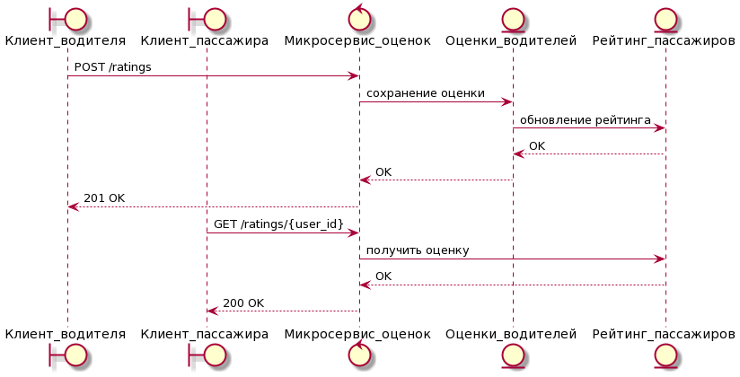
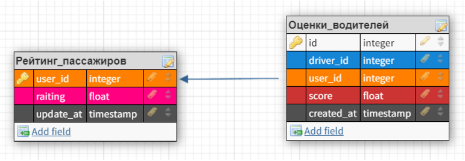

# Фича
Выставление оценки водителем пассажиру после завершения поездки
## Зачем
- Пассажиры получают мнение о себе со стороны водителей, таким образом, у них есть мотивация вести себя лучше.
- Определение  _нелояльных_ пассажиров и уведомление водителей о них.

## MVP
Можно сделать отдельный микросервис, который будет собирать информацию об оценках водителей и затем высчитывать для клиента рейтинг.
Микросервису достаточно две ручки:
- Выставление оценки водителем пассажиру 
- Получение оценки пассажира

[Подробное описание API](doc.yaml)

Среднюю оценку для начала можно считать просто средним арифметическим (последние 15 оценок).
Полноценный вариант должен придавать вес последним оценкам, считать оценку в разрезе различных характеристик (вежливость, удобное место подъезда для водителя, время ожидания и т.д.), проверять что водитель связан с клиентом через заказ.

## Структура БД:
В БД используются две таблицы (_Рейтинг_пассажиров_ и _Оценки_водителей_), связанные по ключу user_id. Связь один ко многим. В варианте MVP достаточно будет прописать триггер, который при редактировании _Оценки_водителей_ будет автоматически пересчитывать поле raiting в таблице _Рейтинг_пассажиров_. Перерасчёт может быть выполнен с помощью "селекта" последних пятнадцати оценок конкретного пользователя и применением агрегатной функции AVG().

## Тестирование:
- Разработчики покрывают функции юнит тестами. Важно проверять успешность сохранения оценки в БД, получение оценки у пассажира без рейтинга, невалидные запросы.
- Интеграционным тестированием проверяем изменение рейтинга при GET-запросе после выставления оценки.
- Нагрузочное тестирование. В данном случае нужно убедиться, что при большом количестве пользователей и оценок - БД будет давать результат запроса за приемлемое время.

# Эксперимент
Включать фичу будем в рамках какого-то региона и наблюдать за метриками. Метриками может быть количество отмен заказов водителем по группам клиентов (лояльные/нелояльные через рейтинг), процент выставленных оценок лояльным клиентам (грубому пассажиру почти всегда поставят рейтинг. Всего же невыставленных оценок определяем исходя из количества заказов и оценок).