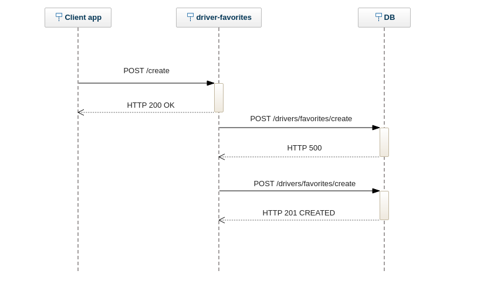

## Описание фичи

После окончания поездки, если пользователь ставит водителю 3 и более звезд, ему предлагается добавить водителя в избранное. При создании следующего заказа, при выборе водителя для клиента, система увеличивает веса для избранных водителей текущего клиента. Как и в случае с рейтингом, водитель не знает, добавил ли его в свой список избранного клиент. Клиент может посмотреть весь свой список избранного и удалить из него записб.

Если мы предположим, что клиент ставит водителю оценку более-менне объективно, то получается, что высокая оценка (например, 5 звезд) еще не означает, что между водителем и клиентом возникла эмпатия. Возможа ситуация, когда, к примеру, в салоне такси не было идеальной чистоты, из-за чего клиент поставил оценку "3 звезды". Однако тем не менее в процессе общения между ними возникла эмпатия, или, например, клиенту понравился музыкальный вкус водителя, и поэтому он не против еще раз воспользоваться услугами данного таксиста. __Гипотеза__: список избранных водителей позволит более точно определять для конкретного клиента наиболее приятного водителя: повышает средний балл водителей и клиентов.


## MVP - Most viable product

### MVP-вариант фичи

Концептуально данная фича не должна быть сложной в реализации, однако, чтобы быстро проверить, что она улучшает user expirience, можно попробовать учитывать, что водитель у пользователя в избранном, только в ситуации, когда есть несколько машин, которые могут добраться до клиента за одно и то же время. Затем надо проверить, что по истечении какого-то времени средняя оценка пользователей, у которых в избранном есть хотя бы один водитель, не уменьшилась.

### Полноценный вариант

На данном этапе можно использовать фактор избранного более широко, попытаться подобрать оптимальный коэффициент веса "избранного" водителя при выборе машины


## Описание архитектуры

1 Клиентское приложение при нажатии "добавить в изранное" отправляет HTTP-запрос, содержащий данные для идентификации клиента и водителя, в микросервис driver-favorites. В случае, если не удается создать соединение между двумя узлами, клиент пробует повторить запрос еще 1-2 раза, после чего пользователю показывается ошибка.

2 Микросервис кладет параметры (условно, driver_id и client_id) в Redis в структуру Set с именем create. Можно класть, например, строку "#{driver_id}_#{client_id}". Также на микросервисе запущен процесс с пулом воркеров, которые асинхронно достают из редиса запись (удаляя ее) и делают POST-запрос на тот микросервис Яндекс.Го, на котором находится БД с водителями и клиентами.

3 Если этот микросервис принимает запрос, сохраняет флаг в какой-нибудь many-to-many таблице driver_client_favorites и отдает HTTP 201, то воркер переходит к следующей записи. Сервер отдает HTTP 4xx в случае, если client_id или driver_id невалидные.
Если микросервис отвечает HTTP 5xx, воркер после небольшого перерыва пробует еще раз, если 4xx, то переходит к следующей записи.

Идемпотентность можно обеспечить на двух уровнях - во-первых, на уровне drivers-favorites, так как данные мы храним в множестве, и если запись все еще присутствует в редисе (не обработана воркером), то мы игнорируем запрос. На уровне сервера с БД нужно также идемпонентно добавлять/удалять избранное.

Запрос на /destroy обрабатывается точно так же, кроме того, что в redis данные кладутся в Set с именем destroy, для каждого множества свой пул воркеров.

UML sequence diagram для сценария, когда клиент отправил запрос в driver-favorites, через какое-то время воркер отправил два запроса в БД, второй окончился успехом:



Примерная OpenAPI-схема для АПИ микросервиса:

```yaml
openapi: 3.0.0
info:
    title: 'favorite-drivers microservice API'
    version: '1.0'

paths:
  /create:
    post:
      description: Create favorite driver
      requestBody:
         $ref: '#/components/requestBodies/favoriteBody'
      responses:
        '200':
          description: "OK"
  /destroy:
    post:
      description: Destroy favorite driver
      requestBody:
        $ref: '#/components/requestBodies/favoriteBody'
      responses:
        '200':
          description: "OK"

components:
  requestBodies:
    favoriteBody:
      description: A JSON object containing client_id and driver_id
      required: true
      content:
        application/json:
          schema:
            title: entry
            type: object
            properties:
              client_id:
                type: integer
                format: int64
                description: client ID
              driver_id:
                type: integer
                format: int64
                description: driver ID
            required:
              - client_id
              - driver_id
```

Микросервис по сути является прокси между клиентом и сервером с БД

## Тестирование

Интеграционное тестирование - проверяем, что при валидном запросе возвращается HTTP 200 и создается запись в Redis. Запускаем джобу и проверяем, что она отправляет правильный http-запрос в микросервис с БД,  при ошибке 5xx отправляет запрос еще несколько раз, при ошибки 4хх переходит к следующей записи. Аналогично проверяет эндпоинт /destroy

## Эксперимент

В первую очередь включаем фичу для 10% водителей с самым высоким рейтингом. Смотрим за статистическими показателями - добавляют ли пользователи водителей в избранное? Как изменяется средния оценка водителей у таких пользователей?
Если показатели нас устраивают, включаем для 25%. Если и в этом случае все метрики нас устраивают, то включаем фичу для всех.
