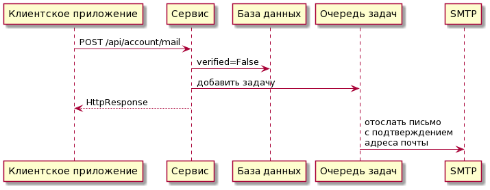
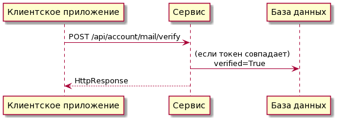
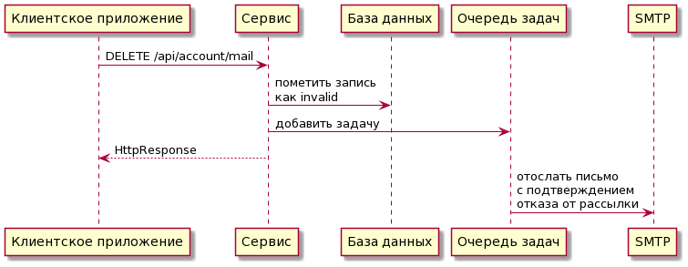
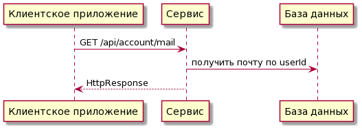
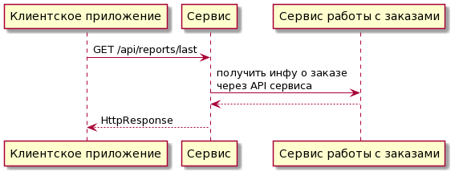

# Проработка фичи

## Описание фичи

Реализовать механизм добавления новой почты в приложении, подтверждение почты, отправку отчетов клиентам и водителям. Предусмотреть возможность получить отчёт по предыдущим поездкам.  

### Гипотезы

+ Привлечение большего числа людей в приложение, увеличение их удовольствия от пользования приложением, т.к. некоторые люди, возможно, захотят получать отчеты и сводки на почту (в том числе, и для ведения учёта доходов и расходов)
+ Эта функциональность может в перспективе быть расширена, например: ~~~добавлена реферальная система~~~ (рассчитано на увеличение темпов прироста клиентской базы), возможность добавить несколько адресов почты, или добавить организацию, для упрощения работы бюрократического аппарата (например, если организация оплачивает поездки своим работникам).

## MVP

### Облегченный вариант:

Отправляем отчет сразу после поезки на добавленную почту, пользуемся локальной БД, и пока что не рассматриваем функциональность получения отчетов по нескольким последним поездкам.

Можно использовать локальную для сервиса реляционную БД с единственной таблицей с колонками: *userId*, *email*.

Также, в принципе для MVP можно опустить верификацию email, очередь задач, и общаться с почтовым сервером напрямую.

### Полноценный вариант:
Архитектура примерно та же самая что и в **MVP**, но, в запрос на отправку отчета по почте добавляется возможность выбора нескольких предыдущих отчетов (фильтр по дате в виде query param).

В качестве БД имеет смысл использовать ту БД, в которой хранится информация об аккаунтах пользователей, доступ к которой может быть осуществлен через API сервиса, работающего с данными пользователей.

Если данные о предыдущих поездках по какой то причине стираются из БД, то отправить отчет по таким поездкам мы уже не сможем, решить эту проблему возможно, если хранить краткую сводку по каждой поездке для пользователя в отдельной, "холодной" базе данных.

## Архитектура

(схемы немного упрощены)

**Добавление Email:**

**Верификация Email** (например, через JWT токен):

**Обновление Email**:

Аналогично добавлению, но метод не POST, а PATCH

**Удаление Email**:

**Получение Email**:

**Получение отчета**:

## Описание API

[OpenApi описание](./openapi.yaml)

## Тестирование

### Юнит-тестирование с покрытием кода

Тестируем функционал отдельных классов, функций.
Тестируем все http-эндпоинты сервиса в связке с *фейковым* сервисом выдачи инфы о поездках. 

### Интеграционное тестирование

Тестируем работу этого сервиса в связке с остальными, проверяем то что сообщения отправляются на почту, и что не возникает странных ситуаций во время работы с удаленной БД или сервисами (отказы,баги).

### Системное тестирование

Тестируем в связке с клиентским приложением, делаем E2E тесты, проверяем то что письма доходят до адресата; убеждаемся в том, что конечный пользователь может(гипотетически) без проблем воспользоваться фичей.

### Нагрузочное
попробуем послать множество запросов на отправку отчетов по большому числу поездок, если почтовый сервер не справляется, то придется искусственно ограничивать на бекенде, и в клиентском приложении, иначе люди не смогут получать письма с верификацией, и всё будет совсем плохо. 

## Эксперимент, поэтапное введение фичи.

Будем использовать фича-тоглы и сервис работы с экспериментами.

Сначала протестируем на команде, потом на контрольной группе людей.

Если возможно, то выделить людей, состоящих в какой либо организации, и включить фичу для них.

Можно выбирать людей, которые уже пользуются другими мобильными приложениями Яндекса, желательно связанными с финансами и покупками (Еда, Лавка, Толока...), в общем, найти тех людей, которые более активно пользуются смартфонами, и имеют тягу к ведению отчетности.

## Мониторинг, анализ.

Метрики, на которые мы смотрим:
1. увеличение числа аккаунтов с добавленным почтовым адресом;
2. увеличение числа поездок;
3. число запросов на получение последних отчетов, и сводок отчетов;
4. изменение темпов прироста клиентской базы, изменение числа аккаунтов с каким то определенным доменом почты (например, корпоративные клиенты).